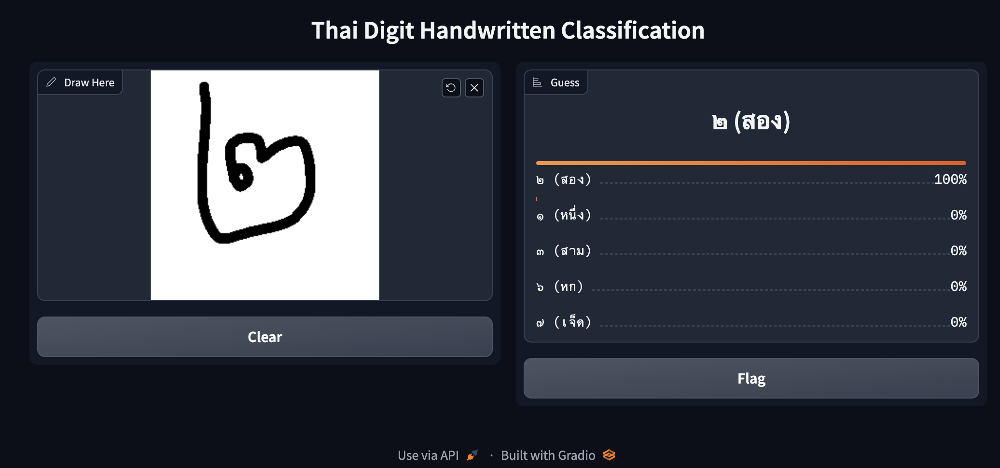

# ใช้ Gradio เพื่อสร้าง application สำหรับโมเดล Thai Handwritten Recognition

การนำโมเดลมาทดลองทำนายจริงทำให้เราเห็นภาพของโมเดลได้ดีที่สุด ในปัจจุบันเรามีไลบรารี่หลากหลายตัวที่ทำให้เราสามารถสร้างแอพพลิเคชั่น
เพื่อให้โมเดลทำนายผลจากภาพหรือข้อมูลได้ เช่น [Streamlit]() หรือ [Gradio]()

โดยเราสามารถรันแอพพลิเคชั่น เช่น Gradio ผ่านออนไลน์แพลตฟอร์ม เช่น [Huggingface Spaces](https://huggingface.co/spaces)
หรือรันผ่าน Google Colaboratory ก็ได้

สำหรับการรัน Gradio บน Google Colab เราต้องมีโมเดลที่เทรนแล้วเรียบร้อย และชุดโค้ดสำหรับการรัน Gradio ซึ่งประกอบด้วยการ install ไลบรารี่ที่จำเป็น
ได้แก่ Gradio และ `torchvision` (สำหรับการ transforms ข้อมูล)

``` sh
!pip install gradio==3.35.0
!pip install torchvision
```

อัพโหลดโมเดลที่เทรนไปเรียบร้อยทาง Google Colab อาจจะตั้งชื่อว่า `thai_digit_net.pth`
_แต่สำหรับผู้ที่อยากทดลองแบบยังไม่เทรนโมเดล สามารถดาวน์โหลดโมเดลได้จาก Github ได้ดังนี้_

``` sh
!wget https://github.com/biodatlab/deep-learning-skooldio/raw/master/saved_model/thai_digit_net.pth
```

สร้าง Class ของโมเดลและโหลด weights ที่เทรนเข้าไปยังโมเดล **ต้องระวัง**ว่าไฟล์ของโมเดลที่เทรนแล้วกับจำนวนเลเยอร์ของโมเดลต้องมีขนาดตรงกัน ไม่เช่นนั้นอาจจะเกิด Errors ได้

``` py
import numpy as np
import torch
from pathlib import Path
import torch.nn as nn
import torch.nn.functional as F
from PIL import Image
from torchvision import transforms
import gradio as gr


transform = transforms.Compose([
    transforms.Resize((28, 28)),
    transforms.Grayscale(),
    transforms.ToTensor()
])
labels = ["๐ (ศูนย์)", "๑ (หนึ่ง)", "๒ (สอง)", "๓ (สาม)", "๔ (สี่)", "๕ (ห้า)", "๖ (หก)", "๗ (เจ็ด)", "๘ (แปด)", "๙ (เก้า)"]
LABELS = {i:k for i, k in enumerate(labels)} # dictionary of index and label


# Load model using DropoutThaiDigit instead
class DropoutThaiDigit(nn.Module):
    def __init__(self):
        super(DropoutThaiDigit, self).__init__()
        self.fc1 = nn.Linear(28 * 28, 392)
        self.fc2 = nn.Linear(392, 196)
        self.fc3 = nn.Linear(196, 98)
        self.fc4 = nn.Linear(98, 10)
        self.dropout = nn.Dropout(0.1)

    def forward(self, x):
        x = x.view(-1, 28 * 28)
        x = self.fc1(x)
        x = F.relu(x)
        x = self.dropout(x)
        x = self.fc2(x)
        x = F.relu(x)
        x = self.dropout(x)
        x = self.fc3(x)
        x = F.relu(x)
        x = self.dropout(x)
        x = self.fc4(x)
        return x


model = DropoutThaiDigit()
model.load_state_dict(torch.load("thai_digit_net.pth"))
model.eval()
```

หลังจากนั้นสร้างคำสั่ง `predict` ที่รับภาพชนิด `PIL` (ตามไลบรารี่ Pillow) โดยการเฉลยผลคำตอบเราจะใช้รูปแบบตาม `gr.Label` ซึ่ง
เป็น dictionary ที่มี key เป็นชื่อของ class ที่เราต้องการทำนายนั่นก็คือตัวเลข และ value เป็นความน่าจะเป็น เช่น

```
{"๐ (ศูนย์)": 0.24, "๑ (หนึ่ง)": 0.12, ...}
```

วิธีการเขียนคือเราจะนำภาพ `img` ใส่เข้าไปในโมเดลที่สร้างขึ้น และเปลี่ยนเป็นความน่าจะเป็นโดยใช้คำสั่ง softmax `probs = model(img).softmax(dim=1).ravel()`
โดยโมเดลจะทำนายความน่าจะเป็นและตำแหน่ง (index) ออกมา หลังจากนั้นเราจะนำ index มาแปลงให้เป็นชื่อของตัวเลข เช่น `๐ (ศูนย์)` แล้วนำทุกอย่างมารวมกันให้อยู่ใน format
ของ dictionary `{label0: prob0, label1: prob1, ...}` ดังด้านล่าง

``` py
def predict(img):
    """
    Predict function takes image and return top 5 predictions
    as a dictionary:

        {label: confidence, label: confidence, ...}
    """
    if img is None:
        return None
    img = transform(img)  # do not need to use 1 - transform(img) because gradio already do it
    probs = model(img).softmax(dim=1).ravel()
    probs, indices = torch.topk(probs, 5)  # select top 5
    probs, indices = probs.tolist(), indices.tolist()  # transform to list
    confidences = {LABELS[i]: v for i, v in zip(indices, probs)}
    return confidences
```

ประกอบร่างทั้งหมดโดยใช้ `gr.Interface` ที่รับ
- ฟังก์ชั่น `predict` ที่รับภาพประเภท PIL และเปลี่ยนให้เป็น dictionary
- `inputs` รับ `gr.Sketchpad` ที่ทำให้ผู้ใช้งานสามารถทดลองวาดตัวเลขบน Sketch pad ได้
- `outputs` รับ `gr.Label` ที่เปลี่ยน dictionary ที่ได้ให้เป็นตารางของ label และความน่าจะเป็น (probability)
- `title` เป็นชื่อของแอพพลิเคชั่นที่จะแสดงด้านบนของแอพพลิเคชั่น
- ทั้งหมดต่อด้วย `.launch(enable_queue=True)` เพื่อสร้าง application ทดลองใช้งานบน Google Colab

``` py
gr.Interface(
    fn=predict,
    inputs=gr.Sketchpad(label="Draw Here", brush_radius=5, type="pil", shape=(120, 120)),
    outputs=gr.Label(label="Guess"),
    title="Thai Digit Handwritten Classification",
    live=True
).launch(enable_queue=True)
```

ตัวอย่างของแอพพลิเคชั่นหลังจากรันแล้วบน Google Colab

