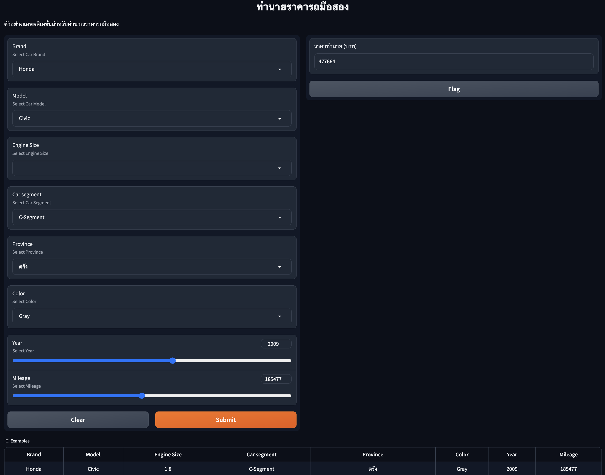

# ใช้ Gradio เพื่อสร้าง application สำหรับโมเดลทำนายราคารถมือสอง

โมเดลทำนายราคารถมือสองประกอบด้วยทั้งโมเดลที่ใช้ในการ scale ค่าต่างๆ และโมเดลที่ใช้สำหรับทำนายราคารถมือสอง

``` sh
!pip install gradio
!pip install gradio_client==0.2.7
```

ทำการ import ไลบรารี่ต่าง ๆ ที่เกี่ยวข้อง เช่น `joblib` สำหรัับอ่านโมเดล, `gradio` เพื่อสร้างแอพพลิเคชั่น, `Dataset` และ `DataLoader` เพื่อใช้เปลี่ยนข้อมูลเป็น features ตามที่ต้องการ

``` py
import joblib
import numpy as np
import pandas as pd
import gradio as gr

import torch
import torch.nn as nn
from torch.utils.data import Dataset, DataLoader
```

_สำหรับผู้ที่อยากทดลองสร้างแอพพลิเคชั่นโดยไม่ต้องการเทรนโมเดลสามารถดาวน์โหลดโมเดลได้ดังนี้_

```sh
!wget https://github.com/biodatlab/deep-learning-skooldio/raw/master/saved_model/carprice/carprice_two_layer_model_mse_00015.pth
!wget https://github.com/biodatlab/deep-learning-skooldio/raw/master/saved_model/carprice/mileage_scaler.joblib
!wget https://github.com/biodatlab/deep-learning-skooldio/raw/master/saved_model/carprice/one_hot_encoder.joblib
!wget https://github.com/biodatlab/deep-learning-skooldio/raw/master/saved_model/carprice/price_scaler.joblib
!wget https://github.com/biodatlab/deep-learning-skooldio/raw/master/saved_model/carprice/year_scaler.joblib
```

จากนั้นสร้างโมเดลและ `Dataset` เตรียมสำหรับการทำนาย

```py
class CarPriceDataset(Dataset):
    def __init__(self, X, y = None):
        self.X = X
        if y is not None:
            self.y = y
        else:
            self.y = None

    def __len__(self):
        return len(self.X)

    def __getitem__(self, idx):
        if self.y is not None:
            return self.X[idx], self.y[idx]
        else:
            return self.X[idx]

class CarPriceTwoLayerModel(nn.Module):
    def __init__(self, input_size, output_size, intermediate_dim = 10):
        super().__init__()
        self.linear1 = nn.Linear(input_size, intermediate_dim)
        self.linear2 = nn.Linear(intermediate_dim, output_size)
        self.relu = nn.ReLU()

    def forward(self, x):
        x = self.linear1(x)
        x = self.relu(x)
        x = self.linear2(x)
        return x

# Load model
pred_model = CarPriceTwoLayerModel(138, 1)
pred_model.load_state_dict(torch.load("carprice_two_layer_model_mse_00015.pth"))

# Load one-hot encoder and scaler
ohe = joblib.load("one_hot_encoder.joblib")
year_scaler = joblib.load("year_scaler.joblib")
mileage_scaler = joblib.load("mileage_scaler.joblib")
price_scaler = joblib.load("price_scaler.joblib")
```

ในส่วนของ Gradio สิ่งที่จำเป็นต้องเตรียมคือคำสั่งที่ทำนายผลจากผู้ใช้งาน
โดยจะเปลี่ยนข้อมูลจากตารางให้กลายเป็น dataframe (`df`) และจากนั้นก็ทำการ scale ข้อมูล
แปลงเป็น `CarPriceDataset` และ `DataLoader` เพื่อป้อนให้กับโมเดล
จากนั้นเปลี่ยนผลการทำนายเป็น integer หรือตัวแปรเต็ม เพื่อใช้ในการแสดงผลต่อไป

```py
CAT_COLUMNS = ["Brand", "Model", "Engine", "Segment", "Province", "Color"]

def predict(model, data_loader):
    model.eval()
    y_pred_list = []
    for x in data_loader:
        y_pred = model(x.float())
        prediction = y_pred.detach().numpy()
        y_pred_list.extend(prediction)
    y_pred_list = np.concatenate(y_pred_list)
    return y_pred_list


def predict_car_price(
    brand: str, model: str, engine: float, segment: str, province: str,
    color: str, year: float, mileage: float
):
    df = pd.DataFrame([{
      "Brand": brand,
      "Model": model,
      "Engine": engine,
      "Segment": segment,
      "Province": province,
      "Color": color,
      "Year": year,
      "Mileage": mileage,
    }])
    features = np.hstack([
        ohe.transform(df[CAT_COLUMNS]),
        year_scaler.transform(df[["Year"]]),
        mileage_scaler.transform(df[["Mileage"]])
    ])
    feat_dataset = CarPriceDataset(features)
    dataloaders = DataLoader(feat_dataset, batch_size=32, shuffle=False)
    y_pred_lr = predict(pred_model, dataloaders)
    return int(price_scaler.inverse_transform(y_pred_lr.reshape(-1, 1)).ravel()[0])
```

## สร้างตัวเลือกและประกอบร่างเป็น Gradio application

ก่อนอื่นต้องเขียนตัวเลือกต่างๆที่เป็นไปได้เพื่อใช้เป็นตัวเลือกของ Dropdown menu ได้แก่ ชื่อแบรนด์รถ (brands), โมเดลของรถ (models), และอื่นๆ

```py
brands = [
  'Toyota', 'Honda', 'Mazda', 'Mitsubishi',
  'Nissan', 'Suzuki'
]
models = [
  'Vios', 'Altis', 'Civic', 'Mazda3', 'Camry',
  'Mirage', 'Brio', 'Lancer Ex', 'Jazz', 'Accord',
  'Lancer', 'Yaris', 'Almera', 'City', 'Swift', 'Mazda2',
  'Teana', 'Note', 'Celerio', 'March', 'Tiida', 'Prius',
  'Ciaz', 'Sylphy', 'Pulsar', 'Attrage', 'Sunny'
]
engines = [
  1.5, 1.8, 1.7, 2.0, 1.2, 1.6, 2.4,
  2.5, 1.0, 1.3, 2.3, 3.0, 2.2
]
segments = ['B-Segment', 'C-Segment', 'D-Segment', 'Eco Car']
provinces = [
  'สงขลา', 'กรุงเทพมหานคร', 'สระบุรี', 'ชัยนาท', 'ระยอง', 'นครสวรรค์',
  'นนทบุรี', 'ตาก', 'สมุทรสาคร', 'เชียงใหม่', 'ลำปาง', 'สุพรรณบุรี', 'เชียงราย',
  'เพชรบุรี', 'พิษณุโลก', 'นครปฐม', 'อุดรธานี', 'สมุทรปราการ', 'ปทุมธานี',
  'นครราชสีมา', 'ชลบุรี', 'ปัตตานี', 'ราชบุรี', 'ลำพูน', 'กระบี่', 'ฉะเชิงเทรา',
  'พัทลุง', 'อ่างทอง', 'ขอนแก่น', 'ปราจีนบุรี', 'สุราษฎร์ธานี', 'ภูเก็ต',
  'หนองบัวลำภู', 'พิจิตร', 'พะเยา', 'ตราด', 'นครศรีธรรมราช', 'บุรีรัมย์',
  'ลพบุรี', 'อุตรดิตถ์', 'ยโสธร', 'อุบลราชธานี', 'สิงห์บุรี', 'พระนครศรีอยุธยา',
  'กาฬสินธุ์', 'สกลนคร', 'ร้อยเอ็ด', 'ระนอง', 'นครพนม', 'อุทัยธานี', 'จันทบุรี',
  'มหาสารคาม', 'กาญจนบุรี', 'แพร่', 'บึงกาฬ', 'กำแพงเพชร', 'สมุทรสงคราม',
  'สุโขทัย', 'ตรัง', 'แม่ฮ่องสอน', 'อำนาจเจริญ', 'นครนายก', 'ชัยภูมิ', 'พังงา',
  'สระแก้ว', 'สุรินทร์', 'นราธิวาส', 'สตูล', 'ประจวบคีรีขันธ์', 'เพชรบูรณ์', 'ศรีสะเกษ',
  'หนองคาย', 'ยะลา', 'น่าน'
]
colors = ['Gray', 'Black', 'Gold', 'Silver', 'Brown', 'White',
          'Red', 'Yellow', 'Blue', 'Green', 'Cyan', 'Orange']
```

จากนั้นประกอบรวมกันโดยใช้ `gr.Interface` ที่ประกอบด้วย

- `gr.Dropdown` สำหรับแบรนด์รถ โมเดลรถ
- `gr.Slider` เพื่อใช้สำหรับเลือกปีของรถ จากปี ค.ศ. 1990 ถึง 2023 และเลขไมล์ที่ใช้งานไปแล้ว
- `examples` เพื่อสร้างตารางตัวอย่างของข้อมูล เพื่อให้ผู้ใช้ทดลองกดเพื่อเติมข้อมูลแล้วรันโมเดลได้ทันที


```py
# ตัวอย่างของข้อมูล
examples = [
  ['Honda', 'Civic', 1.8, 'C-Segment', 'ตรัง', 'Gray', 2009, 185477.0],
  ['Honda', 'Accord', 2.4, 'D-Segment', 'ขอนแก่น', 'Black', 2003, 166508.0],
  ['Honda', 'Jazz', 1.5, 'B-Segment', 'กรุงเทพมหานคร', 'White', 2011, 62000.0],
  ['Honda', 'Civic', 1.8, 'C-Segment', 'พระนครศรีอยุธยา', 'White', 2012, 165346.0],
  ['Suzuki', 'Swift', 1.2, 'Eco Car', 'กรุงเทพมหานคร', 'White', 2016, 193000.0],
  ['Honda', 'City', 1.0, 'B-Segment', 'กรุงเทพมหานคร', 'Gray', 2020, 29000.0],
  ['Honda', 'City', 1.5, 'B-Segment', 'พิษณุโลก', 'Gray', 2007, 126208.0],
  ['Toyota', 'Yaris', 1.5, 'Eco Car', 'เชียงใหม่', 'White', 2013, 100000.0],
  ['Toyota', 'Altis', 1.6, 'C-Segment', 'กรุงเทพมหานคร', 'Silver', 2009, 260000.0],
  ['Honda', 'Civic', 1.8, 'C-Segment', 'กรุงเทพมหานคร', 'Silver', 2006, 232433.0],
]

interface = gr.Interface(
    fn=predict_car_price,
    inputs=[
      gr.Dropdown(brands, label="Brand", info="Select Car Brand"),
      gr.Dropdown(models, label="Model", info="Select Car Model"),
      gr.Dropdown(engines, label="Engine Size", info="Select Engine Size"),
      gr.Dropdown(segments, label="Car segment", info="Select Car Segment"),
      gr.Dropdown(provinces, label="Province", info="Select Province"),
      gr.Dropdown(colors, label="Color", info="Select Color"),
      gr.Slider(1990, 2023, label="Year", info="Select Year"),
      gr.Slider(0, 400000, label="Mileage", info="Select Mileage"),
    ],
    outputs=gr.Textbox(label="ราคาทำนาย (บาท)", placeholder="xxx,xxx (บาท)"),
    examples=examples,
    title="ทำนายราคารถมือสอง",
    description="ตัวอย่างแอพพลิเคชั่นสำหรับคำนวณราคารถมือสอง",
)
interface.launch()
```

ตัวอย่างของแอพพลิเคชั่นหลังจากรันแล้วบน Google Colab

