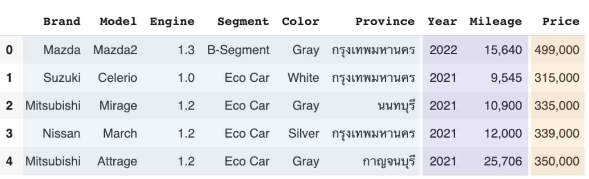

# Deep learning for tabular data

ในบทเรียนสุดท้ายเราได้ทดลองสร้าง Neural network สำหรับการทำนายราคารถมือสอง
เริ่มต้นจากการใช้ไลบรารี่ pandas ในการอ่านข้อมูล พิจารณาฟีเจอร์ที่จะใช้ในการทำนายและข้อมูลที่ต้องการทำนาย
จากนั้นพิจารณาข้อมูลเป็น 2 รูปแบบหลักๆคือ Categorical columns
และ Continuous columns (หรือบางครั้งเรียก Numerical columns ก็ได้)



แถบสีฟ้าคือข้อมูล Categorical columns แถบสีม่วงคือข้อมูล Continuous columns
และแถบสีส้มคือข้อมูลที่ต้องการทำนาย (Price)

## Categorical columns

Categorical columns คือคอลัมน์ของข้อมูลที่แบ่งประเภทได้ สามารถจัดการได้ด้วยวิธีการหลักๆคือ one-hot encoding

```py
from sklearn.preprocessing import OneHotEncoder
CAT_COLUMNS = ["Brand", "Model", "Engine", "Segment", "Province", "Color"]
ohe = OneHotEncoder(handle_unknown="ignore", sparse=False)
cat_train_array = ohe.fit_transform(df_train[CAT_COLUMNS])
```

## Continuous columns

สำหรับข้อมูลที่ต่อเนื่อง เราสามารถใช้ `MinMaxScaler` ในการเปลี่ยนจากค่าตั้งต้นให้เป็นค่าระหว่าง 0 ถึง 1

```py
from sklearn.preprocessing import MinMaxScaler
year_scaler = MinMaxScaler()
mileage_scaler = MinMaxScaler()
price_scaler = MinMaxScaler()

scaled_year = year_scaler.fit_transform(df_train[["Year"]])
scaled_mileage = mileage_scaler.fit_transform(df_train[["Mileage"]])
scaled_price = price_scaler.fit_transform(df_train[["Price"]])
```

ในทางปฏิบัติ `OneHotEncoder` หรือ `MinMaxScaler` จะทำใน training data และนำ preprocessing
เดียวกันไปใช้กับ validation data และ test data ด้วย โค้ดด้านล่างเป็นตัวอย่างการใช้ preprocessing
เตรียมข้อมูลสำหรับการเทรนและการ validate แต่เราจะทำแบบเดียวกันใน test data (ถ้ามีในอนาคต)

```py
X_train = np.hstack([
    ohe.transform(df_train[CAT_COLUMNS]),
    year_scaler.transform(df_train[["Year"]]),
    mileage_scaler.transform(df_train[["Mileage"]])
])
y_train = price_scaler.transform(df_train[["Price"]])

X_val = np.hstack([
    ohe.transform(df_val[CAT_COLUMNS]),
    year_scaler.transform(df_val[["Year"]]),
    mileage_scaler.transform(df_val[["Mileage"]])
])
y_val = price_scaler.transform(df_val[["Price"]])
```

## เซฟ preprocessing ไว้ใช้งานจริง

ใช้ไลบรารี่ `joblib` ในการเซฟ preprocessing ไว้ใช้งานจริง

```py
import joblib
save_dir = "trained_models"
os.makedirs(save_dir, exist_ok=True)
joblib.dump(ohe, op.join(save_dir, "one_hot_encoder.joblib"))
...
```

## Linear Regression

เมื่อเตรียมข้อมูลเรียบร้อย จริงๆแล้วเราสามารถสร้างโมเดล Linear Regression เพื่อทดลองเทรนและใช้งานโมเดลได้เลย

```py
from sklearn.linear_model import LinearRegression
lr_model = LinearRegression()
lr_model.fit(X_train, y_train)
y_pred_lr = lr_model.predict(X_val)

df_val["Predicted_Price_LR"] = price_scaler.inverse_transform(y_pred_lr).ravel()
```

เมื่อทำนายเสร็จแล้ว ใช้ `inverse_transform` ในการแปลงค่าที่ทำนายออกมาเป็นราคาใน scale ตั้งต้น

### ประเมินผลโมเดล

ใช้ Mean Square Error (MSE) ในการคำนวณ error ที่โมเดลทำนายเทียบกับค่าจริง จะใช้ MSE
ที่เขียนด้วยตัวเองหรือใช้ `mean_squared_error` จาก scikit-learn ก็ได้

```py
print("MSE = ", ((y_val - y_pred_lr)**2).sum() / len(y_val))
print("MSE (scikit learn) = ", mean_squared_error(y_val, y_pred_lr))
```

## สร้าง Neural network เพื่อทำนายข้อมูล

สร้าง `Datasest` class เช่นเดิมเพื่อรับข้อมูลที่แปลงเป็น `numpy array` แล้ว

```py
from torch.utils.data import Dataset, DataLoader

class CarPriceDataset(Dataset):
    def __init__(self, X, y = None):
        self.X = X
        if y is not None:
            self.y = y
        else:
            self.y = None

    def __len__(self):
        return len(self.X)

    def __getitem__(self, idx):
        if self.y is not None:
            return self.X[idx], self.y[idx]
        else:
            return self.X[idx]
```

เมื่อสร้าง `Dataset` แล้ว สามารถสร้าง `DataLoader` เพื่อดึงข้อมูลสำหรับเทรนโมเดล

```py
train_dataset = CarPriceDataset(X_train, y_train)
val_dataset = CarPriceDataset(X_val, y_val)
train_dataloader = DataLoader(train_dataset, batch_size=32, shuffle=True)
val_dataloader = DataLoader(val_dataset, batch_size=32, shuffle=False)
```

สุดท้ายสร้างโมเดล Linear Regression ด้วย PyTorch ซึ่งประกอบด้วย `nn.Linear` 1 เลเยอร์

```py
class CarPriceModel(nn.Module):
    def __init__(self, input_size, output_size):
        super().__init__()
        # TODO: create a linear layer with input_size and output_size
        self.linear = nn.Linear(input_size, output_size)

    def forward(self, x):
        x = self.linear(x)
        return x
```

เมื่อทดลองเทรนโมเดลตาม notebook จะเห็นว่าเราได้ accuracy เทียบเท่ากับการใช้ scikit-learn
แต่ข้อดีของการใช้ Neural network คือการที่เราสามารถเพิ่ม layer เพื่อเพิ่มความซับซ้อนของโมเดลได้ เช่น

```py
class CarPriceTwoLayerModel(nn.Module):
    def __init__(self, input_size, output_size, intermediate_dim = 10):
        super().__init__()
        # TODOs: Create two layers neural network
        self.linear1 = nn.Linear(input_size, intermediate_dim)
        self.linear2 = nn.Linear(intermediate_dim, output_size)
        self.relu = nn.ReLU()

    def forward(self, x):
        x = self.linear1(x)
        x = self.relu(x)
        x = self.linear2(x)
        return x
```
